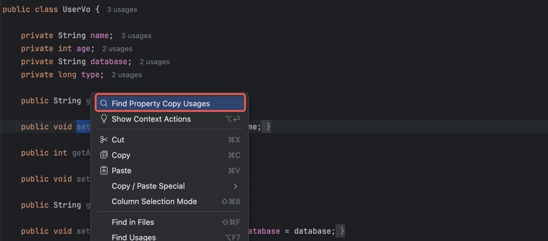
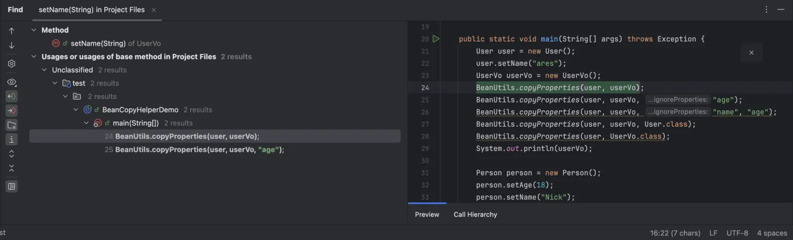
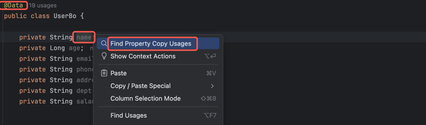
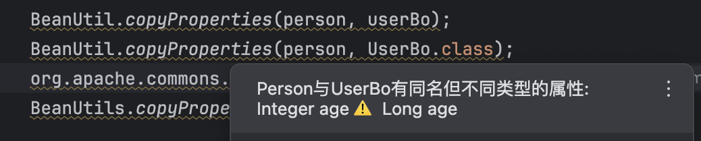
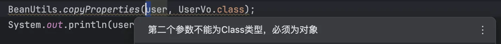
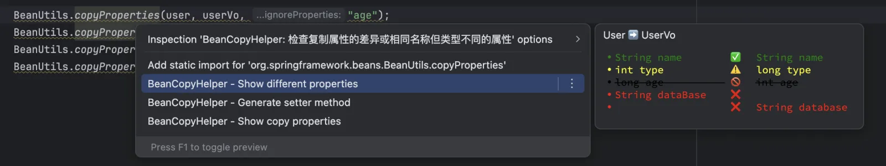
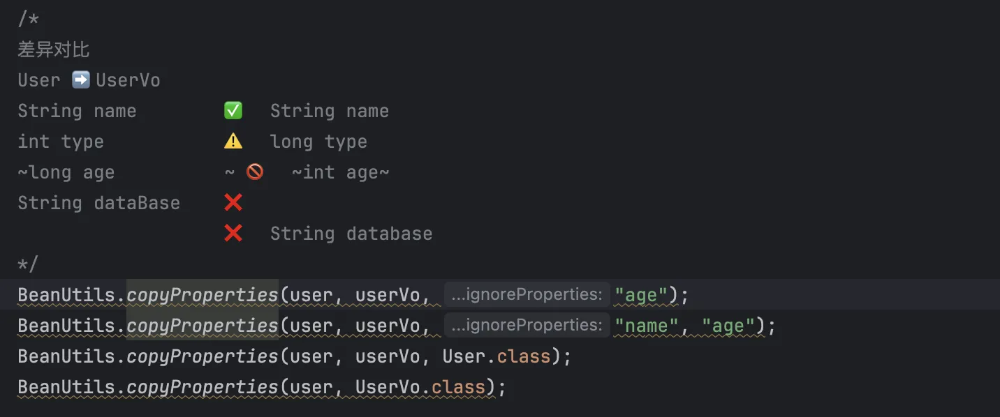
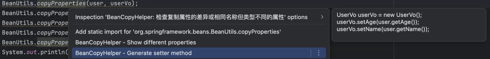
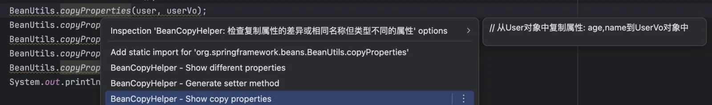
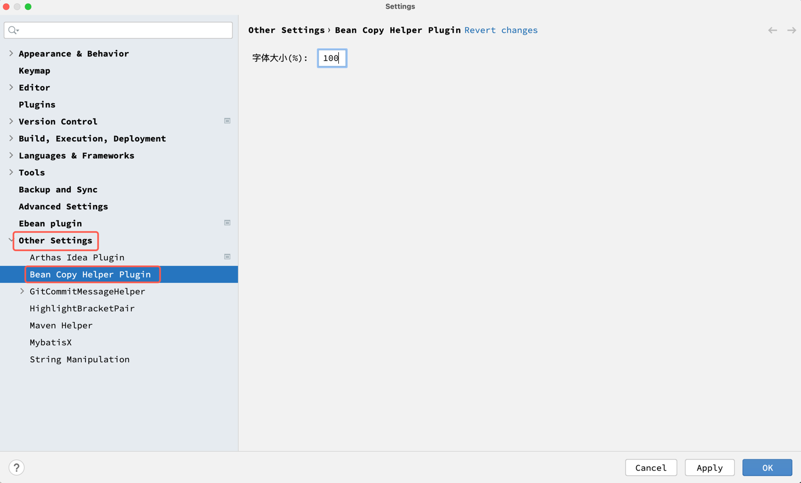

## BeanCopy助手
当前已支持org.springframework.beans.BeanUtils、org.springframework.cglib.beans.BeanCopier、org.apache.commons.beanutils.BeanUtils、cn.hutool.core.bean.BeanUtil等属性复制的识别和转换
### 1.识别属性复制将其转为对应的Getter方法/Setter方法/Field(Lombok)的引用
使用方式: 右击Getter方法/Setter方法/Field(Lombok)后如果存在对应的属性复制会有**Find Property Copy Usages**选项，点击该选项

### 2.属性复制静态检查，对属性名相同类型不一致的复制、没有相同属性的复制和错误用法做告警
使用方式：打开文件即可自动扫描，将光标放置在属性复制方法上时即可显示告警信息

### 3.可以预览源类和目标类属性的对比并生成相应注释
使用方式：将光标放置在属性复制方法上，唤起意图动作 ( ⌥ + Enter for Mac; Alt + Enter for Win/Linux )，选择 "BeanCopyHelper - Show properties compare"即可预览，回车生成预览注释

### 4.生成属性复制对应的Getter/Setter代码
使用方式：将光标放置在属性复制方法上，唤起意图动作 ( ⌥ + Enter for Mac; Alt + Enter for Win/Linux )，选择 "BeanCopyHelper - Generate method"即可预览，回车生成预览代码

### 5.可以预览源类和目标类复制成功的属性并生成相应注释
使用方式：将光标放置在属性复制方法上，唤起意图动作 ( ⌥ + Enter for Mac; Alt + Enter for Win/Linux )，选择 "BeanCopyHelper - Show copy properties"即可预览，回车生成预览注释

### 6.配置字体大小
为了适配不同平台不同版本的IDEA，插件提供了配置项字体大小，该选项为百分比默认为100%，如果需要调整字体大小修改百分比即可
配置路径: `Settings -> Other Settings -> BeanCopyHelper`

## BeanCopy Assistant

Currently supports recognition and transformation of property copy utilities such as org.springframework.beans.BeanUtils, org.springframework.cglib.beans.BeanCopier, org.apache.commons.beanutils.BeanUtils, and cn.hutool.core.bean.BeanUtil.

---

### 1. Identify Property Copies and Reference Corresponding Getter/Setter or Field (Lombok)

**How to use:**  
Right-click on a getter method, setter method, or Lombok field. If the property is involved in a property copy, the **Find Property Copy Usages** option will appear. Click this option to find usages.
  
  

---

### 2. Static Inspection for Property Copy

Automatically scans for issues such as copying between same-named but mismatched types, properties that do not exist, or incorrect API usage.

**How to use:**  
Open the source file for automatic scanning. When the cursor is on a property copy method, warnings will be shown if issues are detected.
  
  

---

### 3. Preview and Annotate Source and Target Class Property Comparison

**How to use:**  
Place the cursor on a property copy method and invoke the intention action menu ( ⌥ + Enter for Mac; Alt + Enter for Win/Linux ), then select "BeanCopyHelper - Show properties compare" to preview. Press Enter to insert the comparison annotation.
  

---

### 4. Generate Getter/Setter Copy Code

**How to use:**  
Place the cursor on a property copy method and invoke the intention action menu ( ⌥ + Enter for Mac; Alt + Enter for Win/Linux ), then select "BeanCopyHelper - Generate method" to preview. Press Enter to insert the generated code.
  

---

### 5. Preview and Annotate Successfully Copied Properties

**How to use:**  
Place the cursor on a property copy method and invoke the intention action menu ( ⌥ + Enter for Mac; Alt + Enter for Win/Linux ), then select "BeanCopyHelper - Show copy properties" to preview. Press Enter to insert the annotation.
  

---

### 6. Font Size Configuration

To adapt to different platforms and IDEA versions, you can adjust the font size as a percentage (default is 100%).

**Path:**  
`Settings -> Other Settings -> BeanCopyHelper`  

#### 参考
- https://github.com/JetBrains/intellij-platform-plugin-template
- https://github.com/GuangYiDing/BeanUtilHelper

## License

This project is licensed under the MIT License - see the [LICENSE](LICENSE) file for details.
